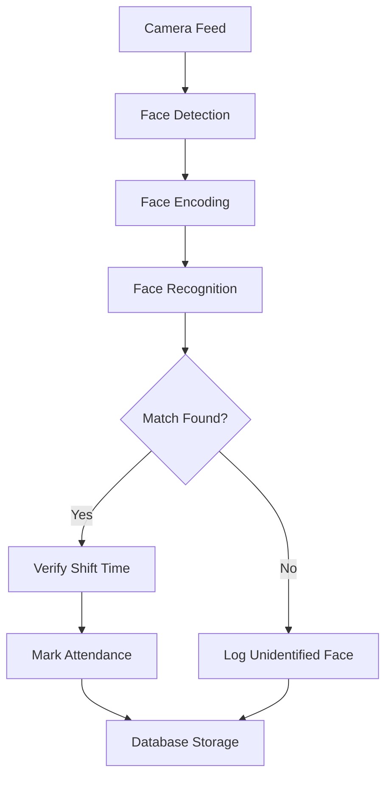

# Face Recognition Attendance System - Demo Presentation Guide

## 📋 Executive Summary

An **AI-powered attendance management system** that uses **face recognition technology** to automatically track employee attendance in real-time through webcam or IP camera feeds. The system eliminates manual attendance marking, prevents buddy punching, and provides comprehensive attendance analytics.

---

## 🎯 Key Value Propositions

- **Automated Attendance**: Zero manual intervention required
- **Real-time Recognition**: Instant face detection and identification
- **Shift Management**: Supports Morning and Night shifts with time-based validation
- **Multi-Camera Support**: Works with webcams and IP cameras
- **Comprehensive Tracking**: Entry/exit timestamps with photo evidence
- **Security**: Identifies and logs unidentified persons

---

## 🏗️ System Architecture

### Technology Stack

**Backend Framework**
- Django 3.1.8 (Python web framework)
- SQLite database (easily upgradeable to PostgreSQL/MySQL)

**AI/ML Libraries**
- **face_recognition** (dlib-based, 99.38% accuracy)
- **OpenCV** (computer vision processing)
- **dlib** (facial landmark detection)

**Frontend**
- Bootstrap Material Design
- Responsive UI with real-time video streaming

### Core Components



---

## 🔑 Key Features

### 1. Employee Management
- Add new employees with multiple face images
- Store employee details (ID, name, age, gender, designation, shift, mobile)
- Upload multiple photos per employee for better recognition accuracy
- Automatic image validation (ensures single visible face)
- Auto-resize images to 300x300 for optimization

### 2. Face Recognition Training
- Custom face encoding generation using 128-dimensional embeddings
- High-accuracy model with 100 jitters for robust encoding
- Batch training support for multiple employees
- Persistent model storage for quick system restart

### 3. Real-time Attendance Tracking
- **Live Video Feed**: Continuous monitoring via webcam or IP camera
- **Automatic Detection**: Identifies faces within defined boundary region
- **Smart Recognition**: Uses voting mechanism (100 frames) for accuracy
- **Shift Validation**: Only marks attendance during correct shift hours
  - Morning Shift: 12:00 PM - 11:59 PM
  - Night Shift: 12:00 AM - 11:59 AM
- **Entry/Exit Tracking**: Automatically logs both entry and exit times
- **Duplicate Prevention**: Prevents multiple attendance marks for same person

### 4. Attendance Records
- **Today's Attendance**: Quick view of current day attendance
- **Historical Records**: Complete attendance history with timestamps
- **Photo Evidence**: Captured face image stored with each attendance record
- **Employee Records**: Comprehensive employee database view

### 5. Security Features
- **Unidentified Face Detection**: Logs unknown persons with timestamp and photo
- **Admin-only Access**: Training and employee management restricted to admins
- **Authentication**: Login required for all system access
- **Shift Enforcement**: Prevents attendance marking outside shift hours

---

## 🎬 Demo Flow (Step-by-Step)

### Phase 1: System Setup (2 minutes)

1. **Login to Admin Panel**
   - Navigate to `http://localhost:8000/`
   - Login with admin credentials
   - Show the clean, modern dashboard

2. **Show Empty State**
   - Navigate to "Add User" page
   - Demonstrate the form fields
   - Explain the shift system

### Phase 2: Employee Registration (3 minutes)

3. **Add First Employee**
   - Fill in employee details:
     - Employee ID: `EMP001`
     - Name: `John Doe`
     - Age: `28`
     - Gender: `Male`
     - Designation: `Software Engineer`
     - Mobile: `+1234567890`
     - Shift: `Morning`
   - Upload 2-3 face images
   - Submit and show validation

4. **Add Second Employee** (Optional)
   - Repeat with different details
   - Show the "User Data for Training" table populating

### Phase 3: Model Training (2 minutes)

5. **Train the Recognition Model**
   - Click "Start Training" button
   - Explain the process:
     - Face encoding generation
     - 128-dimensional feature extraction
     - Model persistence
   - Show training completion message

### Phase 4: Live Recognition Demo (5 minutes)

6. **Setup Camera Feed**
   - Navigate to "Live Stream" page
   - Select camera source (Webcam/IP-CAM)
   - Show live video feed with detection boundary

7. **Demonstrate Face Recognition**
   - Position employee in front of camera
   - Show real-time face detection (red rectangle)
   - Wait for recognition (100-frame voting)
   - Show attendance marked message
   - **Key Point**: Explain shift validation logic

8. **Show Attendance Records**
   - Navigate to "Attendance Records"
   - Show today's attendance with:
     - Employee photo
     - Entry timestamp
     - Employee details
   - Demonstrate exit tracking (if time permits)

### Phase 5: Security Features (2 minutes)

9. **Unidentified Person Detection**
   - Show an unidentified face to camera
   - Navigate to "Unidentified Faces Records"
   - Show logged unknown person with timestamp

10. **Employee Records**
    - Navigate to "Employee Records"
    - Show comprehensive employee database
    - Highlight the clean, card-based UI

---

## 💡 Technical Highlights (For Technical Audience)

### Face Recognition Algorithm
- **Model**: dlib's ResNet-based face recognition
- **Accuracy**: 99.38% on Labeled Faces in the Wild benchmark
- **Encoding**: 128-dimensional face embeddings
- **Matching**: Euclidean distance comparison with threshold
- **Robustness**: 100 jitters during encoding for variation handling

### Performance Optimizations
- Frame downscaling (0.25x) for faster processing
- Boundary-based detection to reduce false positives
- Voting mechanism (100 frames) to prevent flickering
- Automatic image resizing to 300x300
- Efficient pickle-based model serialization

### Scalability Considerations
- Modular architecture for easy feature additions
- Database-agnostic design (currently SQLite, easily upgradeable)
- Support for multiple camera sources
- RESTful URL structure for API integration potential

---

## 🗣️ Key Talking Points

### Problem Statement
*"Traditional attendance systems rely on manual entry, biometric devices, or RFID cards. These are prone to buddy punching, require physical contact, and lack photo evidence."*

### Solution
*"Our system uses advanced AI to automatically recognize employees from camera feeds, marking attendance without any physical interaction. It's contactless, tamper-proof, and provides photo evidence for every entry."*

### Unique Features
- **Shift-aware**: Won't mark attendance outside designated shift hours
- **Photo Evidence**: Every attendance record includes a captured photo
- **Security Monitoring**: Logs unidentified persons automatically
- **Multi-image Training**: Supports multiple photos per employee for better accuracy

### Business Benefits
- **Time Savings**: Eliminates manual attendance marking
- **Accuracy**: 99%+ recognition accuracy
- **Security**: Prevents proxy attendance and unauthorized access
- **Compliance**: Automatic record-keeping with timestamps and photos
- **Cost-effective**: Uses existing cameras, no special hardware needed

---

## 🔧 System Requirements

### Hardware
- Webcam or IP camera (minimum 720p recommended)
- Standard PC/Server (4GB RAM minimum)

### Software
- Python 3.7+
- Windows/Linux/macOS
- Modern web browser

---

## 📊 Demo Metrics to Highlight

- **Recognition Speed**: < 2 seconds per face
- **Accuracy**: 99%+ with proper training images
- **Concurrent Users**: Supports multiple camera feeds
- **Storage**: Minimal (images auto-resized to 300x300)
- **Training Time**: ~5-10 seconds per employee

---

## ❓ Anticipated Questions & Answers

**Q: What happens if someone wears glasses or a mask?**
A: The system is trained on multiple images per person. If trained with glasses, it will recognize with glasses. Masks may reduce accuracy, but we can train with masked images if needed.

**Q: Can it handle multiple people in frame?**
A: Yes, it detects all faces but uses a boundary region to focus on the primary subject for attendance marking.

**Q: What about lighting conditions?**
A: The system works in various lighting conditions. We recommend consistent lighting for best results. The model can be retrained with different lighting samples.

**Q: How do you prevent false positives?**
A: We use a 100-frame voting mechanism. A person must be consistently recognized across 100 frames before attendance is marked.

**Q: Can this integrate with existing HR systems?**
A: Yes, the system uses a standard database structure and can be integrated via API or database sync.

**Q: What about privacy concerns?**
A: Face encodings are stored as mathematical representations, not actual photos. Photos are only stored for attendance records with proper access controls.

---

## 🎯 Demo Success Checklist

- [ ] System is running on `http://localhost:8000/`
- [ ] Admin account is created and tested
- [ ] At least 2 test employees ready to add
- [ ] 2-3 clear face photos per employee prepared
- [ ] Camera is working and positioned correctly
- [ ] Good lighting in demo area
- [ ] Browser is open and ready
- [ ] Database is clean (fresh start)

---

## 🚀 Future Enhancements (If Asked)

1. **Mobile App**: Flutter/React Native app for remote monitoring
2. **Cloud Deployment**: AWS/Azure hosting for multi-location support
3. **Analytics Dashboard**: Attendance trends, late arrivals, overtime tracking
4. **Integration**: Payroll system integration, Slack/Teams notifications
5. **Advanced Features**: Temperature detection, mask detection, visitor management
6. **Reporting**: PDF/Excel export, automated monthly reports
7. **Multi-tenancy**: Support for multiple organizations

---

## 📝 Quick Command Reference

```bash
# Start the server
python manage.py runserver

# Create superuser (if needed)
python manage.py createsuperuser

# Reset database (if needed)
Remove-Item db.sqlite3
python manage.py migrate
python manage.py createsuperuser
```

---

## 🎬 Closing Statement

*"This system demonstrates how AI and computer vision can solve real-world business problems. It's scalable, accurate, and ready for production deployment. The contactless nature makes it perfect for post-pandemic workplaces, and the photo evidence ensures accountability and security."*

---

**Good luck with your demo! 🎉**
